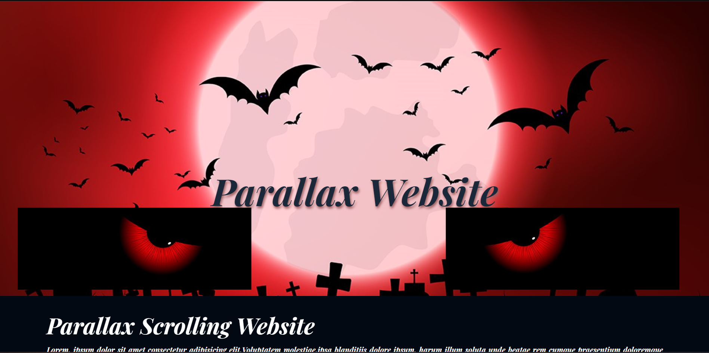
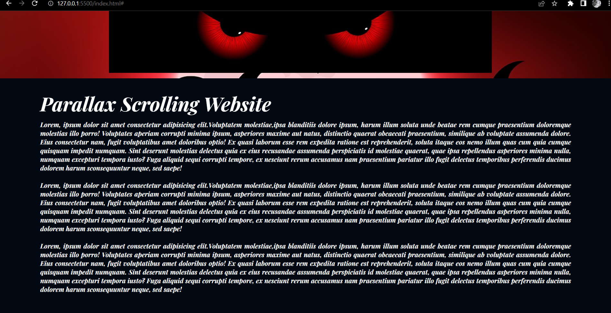

# :computer:**Parallax Scrolling Website**
*A Parallax Scrolling website I made using `HTML, CSS and JavaScript`.Have Fun :smile:*

<a href="https://sude-go.github.io/Parallax-Scrolling-Website/">Take a look</a>

>
>
>
  

## :camera_flash:İmages :spider_web::bat:
  
  
  
  
